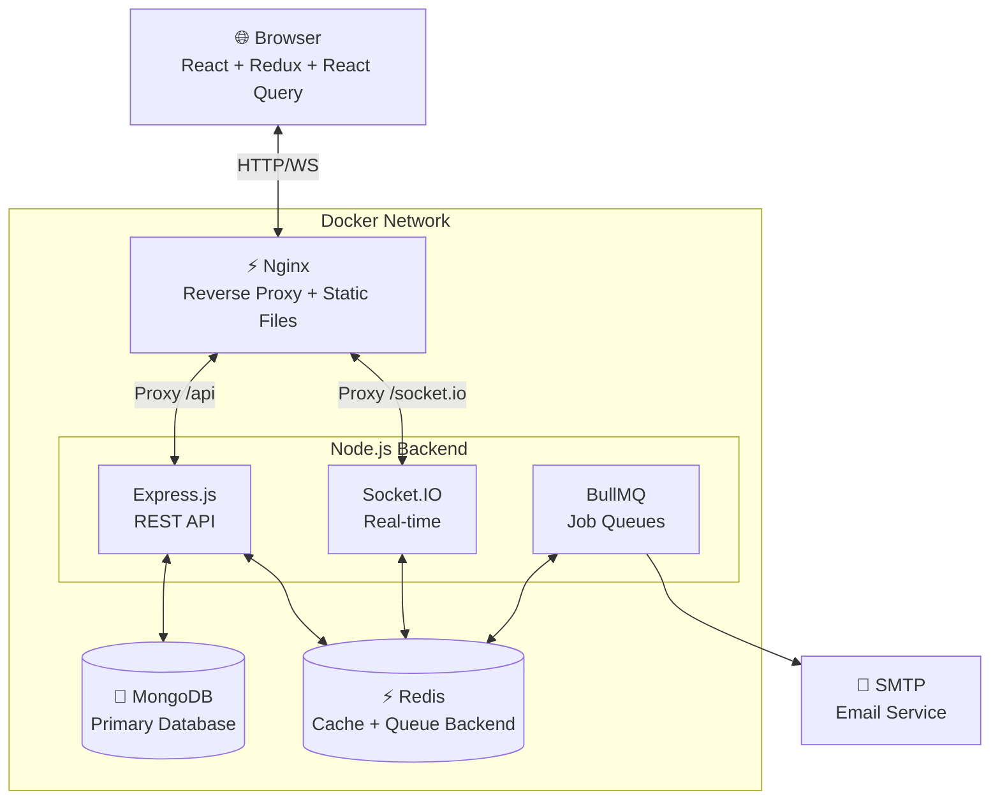
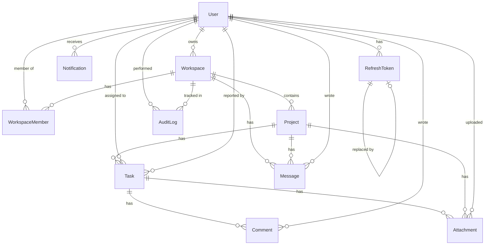

# MiniSaaS

> A production-ready, full-stack SaaS application inspired by **Notion**, **Trello**, and **Slack**.

[](https://github.com/your-org/minisaas/actions/workflows/ci.yml)

---

## Table of Contents

1. [Project Overview](#1-project-overview)
2. [Features](#2-features)
3. [Tech Stack](#3-tech-stack)
4. [Architecture](#4-architecture)
5. [Folder Structure](#5-folder-structure)
6. [Database Design](#6-database-design)
7. [ER Diagram](#7-er-diagram)
8. [API Documentation](#8-api-documentation)
9. [Authentication](#9-authentication)
10. [RBAC](#10-rbac)
11. [Redis Architecture](#11-redis-architecture)
12. [Socket.IO Architecture](#12-socketio-architecture)
13. [BullMQ Architecture](#13-bullmq-architecture)
14. [File Upload Architecture](#14-file-upload-architecture)
15. [Local Development](#15-local-development)
16. [Environment Variables](#16-environment-variables)
17. [Docker Setup](#17-docker-setup)
18. [Testing](#18-testing)
19. [CI/CD](#19-cicd)
20. [Deployment](#20-deployment)
21. [Security](#21-security)
22. [Future Improvements](#22-future-improvements)

---

## 1. Project Overview

MiniSaaS is a collaborative project management platform that combines:

- **Task boards** (Kanban-style, like Trello)
- **Document workspaces** (workspace/project structure, like Notion)
- **Team chat** (real-time messaging, like Slack)

Built across 5 phases from a clean database layer up to a production-ready deployment with Docker, CI/CD, and real-time communication.

---

## 2. Features

### Core
- ✅ User registration and login with JWT (access + refresh token rotation)
- ✅ Multi-workspace support with role-based access control
- ✅ Project management (create, update, archive)
- ✅ Kanban board with drag-and-drop
- ✅ Task management (status, priority, assignee, due date)
- ✅ Task comments with edit/delete
- ✅ File attachments (avatar + task attachments)
- ✅ Real-time notifications
- ✅ Workspace member management (invite, role change, remove)
- ✅ Audit log trail

### Real-time (Phase 4)
- ✅ Socket.IO for live task updates
- ✅ Team chat (workspace-level)
- ✅ Typing indicators
- ✅ Online presence

### Infrastructure (Phase 4-5)
- ✅ Redis caching with automatic invalidation
- ✅ BullMQ background job queues
- ✅ Email queue (workspace invites, daily summaries)
- ✅ Global full-text search
- ✅ Progressive Web App (offline support)
- ✅ Docker + Docker Compose
- ✅ GitHub Actions CI/CD
- ✅ Swagger/OpenAPI documentation

---

## 3. Tech Stack

### Backend
| Layer | Technology |
|---|---|
| Runtime | Node.js 20 |
| Framework | Express.js 4 |
| Language | JavaScript (CommonJS) |
| Database | MongoDB 7 + Mongoose 8 |
| Cache / Queue backend | Redis 7 + ioredis |
| Job queues | BullMQ 5 |
| Real-time | Socket.IO 4 |
| Validation | Zod + Mongoose schema validation |
| Auth | JWT (jsonwebtoken) + bcryptjs |
| File uploads | Multer |
| Email | Nodemailer |
| Logging | Winston |
| API docs | Swagger (swagger-jsdoc + swagger-ui-express) |

### Frontend
| Layer | Technology |
|---|---|
| Framework | React 18 |
| Build tool | Vite 6 |
| Language | TypeScript |
| Routing | React Router v6 |
| Server state | TanStack React Query v5 |
| Client state | Redux Toolkit |
| Forms | React Hook Form + Zod |
| Drag & drop | DnD Kit |
| Styling | Tailwind CSS v3 |
| HTTP client | Axios |
| Realtime | Socket.IO Client |
| Testing | Vitest + Testing Library |

---

## 4. Architecture

### System Architecture



### Request Flow

```
Browser Request
    ↓
Nginx (reverse proxy)
    ↓
Express Middleware (helmet, cors, rate-limit, body-parser, cookie-parser)
    ↓
Router
    ↓
Zod Validator
    ↓
Auth Middleware (JWT verify)
    ↓
RBAC Middleware (workspace membership check)
    ↓
Controller (thin — only req/res handling)
    ↓
Service (business logic, cache, socket emit)
    ↓
Repository (MongoDB queries)
    ↓
Mongoose Model
    ↓
MongoDB
```

---

## 5. Folder Structure

```
.
├── .github/
│   └── workflows/
│       ├── ci.yml              # Lint, test, build on every PR
│       └── cd.yml              # Build + push Docker images on main
├── client/                     # React frontend (Vite + TypeScript)
│   ├── public/
│   │   ├── manifest.json       # PWA manifest
│   │   └── sw.js               # Service worker
│   ├── src/
│   │   ├── app/
│   │   ├── components/         # Reusable UI components
│   │   │   ├── auth/
│   │   │   ├── chat/
│   │   │   ├── comments/
│   │   │   ├── search/
│   │   │   ├── tasks/
│   │   │   ├── ui/             # Primitive UI: Button, Input, Modal, etc.
│   │   │   └── uploads/
│   │   ├── features/           # Feature-scoped React Query hooks
│   │   ├── hooks/              # Custom React hooks
│   │   ├── layouts/            # DashboardLayout, Sidebar, TopNav
│   │   ├── lib/                # axios instance, queryClient, socket
│   │   ├── pages/              # Route-level page components
│   │   ├── services/           # API service functions
│   │   ├── store/              # Redux slices (auth, workspace, ui)
│   │   ├── test/               # Test setup + integration tests
│   │   ├── types/              # TypeScript interfaces
│   │   └── utils/              # cn, format, pwa helpers
│   ├── Dockerfile
│   ├── nginx.conf
│   └── package.json
├── server/                     # Node.js backend (Express + MongoDB)
│   ├── scripts/
│   │   └── seed.js             # Database seed script
│   ├── src/
│   │   ├── config/             # env, database, redis, socket, queues, swagger
│   │   ├── middlewares/        # authenticate, authorize, upload, error
│   │   ├── models/             # 11 Mongoose models
│   │   ├── modules/            # Feature modules (controller + routes)
│   │   │   ├── auth/
│   │   │   ├── auditLogs/
│   │   │   ├── chat/
│   │   │   ├── comments/
│   │   │   ├── notifications/
│   │   │   ├── projects/
│   │   │   ├── search/
│   │   │   ├── tasks/
│   │   │   ├── uploads/
│   │   │   ├── users/
│   │   │   └── workspaces/
│   │   ├── repositories/       # Data access layer (9 repositories)
│   │   ├── services/           # Business logic (9 services)
│   │   ├── utils/              # ApiError, ApiResponse, hash, jwt, pagination
│   │   └── validators/         # Zod schemas (9 validators)
│   ├── tests/
│   │   ├── integration/        # Supertest API tests
│   │   ├── models/             # Mongoose model unit tests
│   │   └── helpers/
│   ├── Dockerfile
│   └── package.json
├── docker-compose.yml
├── .env.example
├── .gitignore
└── README.md
```

---

## 6. Database Design

### Collections (11 total)

| Collection | Purpose | Key Indexes |
|---|---|---|
| `users` | Application accounts | email (unique), status, deletedAt |
| `workspaces` | Tenant workspaces | slug (unique), ownerId |
| `workspacemembers` | Workspace membership + RBAC | (workspaceId+userId) unique compound |
| `projects` | Projects within workspaces | (workspaceId+key) unique compound |
| `tasks` | Tasks with Kanban support | projectId+status+position, text(title,description) |
| `comments` | Task comment threads | taskId+createdAt |
| `notifications` | User notification inbox | userId+isRead+createdAt |
| `auditlogs` | Immutable activity trail | workspaceId+createdAt, entityType+entityId |
| `attachments` | File metadata (no binaries) | taskId, projectId, uploadedBy |
| `refreshtokens` | JWT refresh token store | tokenHash (unique), userId+expiresAt |
| `messages` | Chat messages | workspaceId+createdAt, projectId+createdAt |

---

## 7. ER Diagram



---

## 8. API Documentation

**Swagger UI:** `http://localhost:5000/api-docs`

### API Summary (31 endpoints)

| Method | Path | Description |
|---|---|---|
| POST | `/auth/register` | Register new account |
| POST | `/auth/login` | Login, get tokens |
| POST | `/auth/refresh-token` | Rotate refresh token |
| POST | `/auth/logout` | Revoke refresh token |
| GET | `/auth/me` | Get current user |
| GET | `/users/me` | Get profile |
| PUT | `/users/me` | Update profile |
| PUT | `/users/me/password` | Change password |
| POST | `/workspaces` | Create workspace |
| GET | `/workspaces` | List user's workspaces |
| GET | `/workspaces/:id` | Get workspace |
| PUT | `/workspaces/:id` | Update workspace |
| DELETE | `/workspaces/:id` | Delete workspace |
| POST | `/workspaces/:id/members` | Invite member |
| GET | `/workspaces/:id/members` | List members |
| PUT | `/workspaces/:id/members/:memberId` | Update role |
| DELETE | `/workspaces/:id/members/:memberId` | Remove member |
| GET | `/workspaces/:id/audit-logs` | Audit trail |
| POST | `/projects` | Create project |
| GET | `/projects` | List projects |
| GET | `/projects/:id` | Get project |
| PUT | `/projects/:id` | Update project |
| DELETE | `/projects/:id` | Delete project |
| POST | `/tasks` | Create task |
| GET | `/tasks` | List/filter tasks |
| GET | `/tasks/:id` | Get task |
| PUT | `/tasks/:id` | Update task |
| DELETE | `/tasks/:id` | Delete task |
| PATCH | `/tasks/:id/status` | Update status |
| PATCH | `/tasks/:id/assignee` | Update assignee |
| POST | `/tasks/:taskId/comments` | Add comment |
| GET | `/tasks/:taskId/comments` | List comments |
| PUT | `/comments/:id` | Edit comment |
| DELETE | `/comments/:id` | Delete comment |
| GET | `/notifications` | List notifications |
| PATCH | `/notifications/:id/read` | Mark as read |
| PATCH | `/notifications/read-all` | Mark all as read |
| POST | `/upload/avatar` | Upload avatar |
| POST | `/upload/attachment` | Upload file |
| DELETE | `/upload/attachment/:id` | Delete file |
| GET | `/upload/attachments` | List attachments |
| GET | `/chat/:workspaceId/messages` | Chat history |
| DELETE | `/chat/messages/:id` | Delete message |
| GET | `/search` | Global search |
| GET | `/health` | Health check |

---

## 9. Authentication

### Flow

```
Register → POST /auth/register → 201 {user}

Login → POST /auth/login
  → 200 { accessToken, user }
  → Set-Cookie: refreshToken=<jwt> (httpOnly, sameSite=strict)

Authenticated requests:
  Authorization: Bearer <accessToken>

Token expiry → 401 → Client calls POST /auth/refresh-token
  → Sends refreshToken cookie automatically
  → 200 { accessToken }  (new refreshToken cookie set)

Logout → POST /auth/logout
  → Revokes refresh token in DB
  → Clears cookie
```

### Token Storage
- **Access token**: Redux store (memory only — never localStorage)
- **Refresh token**: httpOnly cookie (inaccessible to JavaScript)
- **DB storage**: Only SHA-256 hash of refresh token (never the raw JWT)

### Token Rotation
Each refresh invalidates the old token and issues a new one with a new DB record.

---

## 10. RBAC

### Roles (per workspace)

| Role | Can read | Can create tasks | Can manage members | Can delete workspace |
|---|---|---|---|---|
| `guest` | ✅ | ❌ | ❌ | ❌ |
| `member` | ✅ | ✅ | ❌ | ❌ |
| `admin` | ✅ | ✅ | ✅ (invite/remove members) | ❌ |
| `owner` | ✅ | ✅ | ✅ | ✅ |

### Resource Isolation
Users can only access projects, tasks, comments, and members of workspaces they belong to. This is enforced at the service layer — not just middleware.

---

## 11. Redis Architecture

```
Cache Keys:
  workspace:{id}:dashboard     TTL: 60s
  workspace:{id}:projects      TTL: 120s
  project:{id}:tasks           TTL: 60s
  user:{id}:notifications      TTL: 30s
  workspace:{id}:presence      (ephemeral)

Invalidation triggers:
  Task created/updated/deleted → invalidate project tasks + workspace dashboard
  Project created/updated      → invalidate workspace projects
  Notification read            → invalidate user notifications

Redis is optional: REDIS_ENABLED=false falls back to no-cache mode gracefully.
Socket.IO uses Redis adapter for multi-instance pub/sub.
BullMQ uses Redis as its queue backend.
```

---

## 12. Socket.IO Architecture

### Rooms
- `workspace:{workspaceId}` — all workspace members
- `project:{projectId}` — project members
- `user:{userId}` — personal notifications

### Events

| Event | Direction | Payload |
|---|---|---|
| `workspace:join` | Client→Server | `{ workspaceId }` |
| `workspace:leave` | Client→Server | `{ workspaceId }` |
| `project:join` | Client→Server | `{ projectId, workspaceId }` |
| `task.created` | Server→Client | Task object |
| `task.updated` | Server→Client | Task object |
| `task.deleted` | Server→Client | `{ _id, workspaceId, projectId }` |
| `task.statusChanged` | Server→Client | Task + previousStatus |
| `notification.created` | Server→Client | Notification object |
| `chat.message` | Both | ChatMessage object |
| `chat.typing` | Both | `{ userId, name, isTyping }` |
| `user.online` | Server→Client | `{ userId, name }` |
| `user.offline` | Server→Client | `{ userId }` |

### Security
Every Socket.IO connection requires a valid JWT access token (verified in the `io.use()` middleware). Workspace/project room joins verify DB membership before admitting the socket.

---

## 13. BullMQ Architecture

### Queues

| Queue | Purpose | Schedule |
|---|---|---|
| `email` | Workspace invites, password resets | On-demand |
| `notifications` | Create DB notification + emit socket | On-demand |
| `daily-summary` | Email users their overdue tasks | Cron: 08:00 daily |
| `cleanup` | Delete expired refresh tokens | Cron: 02:00 daily |

### Retry Policy
All jobs: 3 attempts, exponential backoff starting at 2s.
Failed jobs retained for 200 entries. Completed jobs retained for 100 entries.

---

## 14. File Upload Architecture

```
Client → POST /api/v1/upload/attachment (multipart/form-data)
       ↓
  Authenticate middleware (JWT)
       ↓
  Multer (disk storage to /uploads/attachments/)
       ↓
  File validation:
    - Extension whitelist check
    - MIME type whitelist check  ← never trust MIME alone
    - Size limit (5 MB default)
       ↓
  WorkspaceMember check (is requester a member?)
       ↓
  Create Attachment record in MongoDB (metadata only)
       ↓
  Return { url, fileName, size, mimeType, ... }
```

Files are served statically via `/uploads/*`.

Supported types: JPEG, PNG, GIF, WebP, PDF, DOC/DOCX, XLS/XLSX, TXT, CSV, ZIP.

---

## 15. Local Development

### Prerequisites
- Node.js ≥ 20
- MongoDB ≥ 7 (or use Docker)
- Redis ≥ 7 (optional — set `REDIS_ENABLED=false` to skip)

### Setup

```bash
# 1. Clone the repository
git clone https://github.com/your-org/minisaas.git
cd minisaas

# 2. Backend
cd server
cp .env.example .env
# Edit .env — set MONGODB_URI, JWT secrets
npm install
npm run dev          # starts on :5000

# 3. Frontend (new terminal)
cd client
npm install
npm run dev          # starts on :3000 with Vite proxy to :5000

# 4. (Optional) Seed the database
cd server
npm run seed
```

### Available scripts

**Backend:**
```bash
npm run dev          # nodemon watch
npm run start        # production start
npm run lint         # ESLint
npm run lint:fix     # auto-fix
npm test             # Jest (replica set for transactions)
npm run test:coverage
npm run seed
```

**Frontend:**
```bash
npm run dev          # Vite dev server
npm run build        # tsc + vite build
npm run lint         # ESLint
npm test             # Vitest
npm run preview      # Preview production build
```

---

## 16. Environment Variables

Copy `.env.example` and fill in your values:

| Variable | Required | Default | Description |
|---|---|---|---|
| `NODE_ENV` | ✅ | `development` | `development`, `test`, or `production` |
| `PORT` | ✅ | `5000` | Backend port |
| `MONGODB_URI` | ✅ | — | MongoDB connection string |
| `JWT_ACCESS_SECRET` | ✅ | — | ≥32 chars random string |
| `JWT_REFRESH_SECRET` | ✅ | — | Different from access secret |
| `JWT_ACCESS_EXPIRES_IN` | | `15m` | Access token TTL |
| `JWT_REFRESH_EXPIRES_IN` | | `7d` | Refresh token TTL |
| `CORS_ORIGIN` | ✅ | `http://localhost:3000` | Frontend URL |
| `REDIS_URL` | | `redis://localhost:6379` | Redis connection |
| `REDIS_ENABLED` | | `false` | Enable Redis cache+queues |
| `SMTP_HOST` | | — | SMTP server host |
| `SMTP_PORT` | | `587` | SMTP port |
| `SMTP_USER` | | — | SMTP username |
| `SMTP_PASS` | | — | SMTP password |
| `SMTP_FROM` | | `noreply@minisaas.app` | From email address |
| `UPLOAD_DIR` | | `uploads` | Local upload directory |
| `MAX_FILE_SIZE` | | `5242880` | Max upload in bytes (5 MB) |
| `LOG_LEVEL` | | `info` | Winston log level |

> **Never commit `.env` files.** Generate JWT secrets with:
> `node -e "console.log(require('crypto').randomBytes(64).toString('hex'))"`

---

## 17. Docker Setup

### Quick start

```bash
# 1. Copy and configure environment
cp .env.example .env
# Edit .env — set JWT_ACCESS_SECRET, JWT_REFRESH_SECRET at minimum

# 2. Start all services
docker compose up -d

# 3. Check health
curl http://localhost/health
# → { "status": "ok", "database": "connected", "redis": "connected" }

# 4. Open the app
open http://localhost

# 5. View Swagger docs
open http://localhost/api-docs
```

### Services

| Service | Port | Purpose |
|---|---|---|
| `frontend` | 80 | Nginx + React SPA |
| `backend` | 5000 | Express API |
| `mongodb` | 27017 | MongoDB |
| `redis` | 6379 | Redis |

### Docker commands

```bash
docker compose up -d              # start all
docker compose down               # stop all
docker compose logs -f backend    # stream backend logs
docker compose ps                 # service status
docker compose exec mongodb mongosh  # MongoDB shell
docker compose exec redis redis-cli  # Redis CLI

# Rebuild after code changes
docker compose up -d --build backend
docker compose up -d --build frontend
```

---

## 18. Testing

### Backend (Jest + MongoMemoryServer)

```bash
cd server
npm test                    # all 185 tests
npm run test:coverage       # with coverage report
```

**Test suites (18 total):**
- 10 model unit tests (Mongoose validation, indexes, relationships)
- 8 integration tests (Auth, Users, Workspaces, Projects, Tasks, Comments, Notifications, RBAC)

### Frontend (Vitest + Testing Library)

```bash
cd client
npm test                    # 6 component tests
```

---

## 19. CI/CD

### CI (`ci.yml`) — runs on every push and PR

1. **Backend**: install → lint → test → syntax check
2. **Frontend**: install → TypeScript check → test → build → upload artifact

All steps must pass. Any failure blocks the PR.

### CD (`cd.yml`) — runs on push to `main`

1. Build Docker images for backend + frontend
2. Push to GitHub Container Registry (`ghcr.io`)
3. Deploy via SSH to production server

### Required GitHub Secrets

| Secret | Description |
|---|---|
| `GITHUB_TOKEN` | Auto-provided by GitHub Actions |
| `DEPLOY_HOST` | Production server IP/hostname |
| `DEPLOY_USER` | SSH username |
| `DEPLOY_SSH_KEY` | Private SSH key |

---

## 20. Deployment

### Production checklist

- [ ] Set `NODE_ENV=production`
- [ ] Generate strong JWT secrets (64 random bytes each)
- [ ] Set `REDIS_ENABLED=true`
- [ ] Configure SMTP credentials for email
- [ ] Set `CORS_ORIGIN` to your frontend domain
- [ ] Use a managed MongoDB (Atlas) or secure self-hosted
- [ ] Configure persistent Docker volumes for uploads and data
- [ ] Set up SSL/TLS termination (nginx proxy or load balancer)
- [ ] Configure log aggregation (CloudWatch, Datadog, Loki)

### One-command deploy (Docker Compose)

```bash
# On your server
git clone https://github.com/your-org/minisaas.git
cd minisaas
cp .env.example .env
# Fill in production values
docker compose up -d
```

---

## 21. Security

### Implemented

| Category | Implementation |
|---|---|
| Password hashing | bcrypt with 12 salt rounds |
| JWT | Short-lived access (15m) + rotating refresh (7d) |
| Refresh token storage | SHA-256 hash in DB (never raw JWT) |
| HTTP security headers | Helmet.js |
| CORS | Whitelist-only, credentials mode |
| Rate limiting | Per-IP, per-endpoint (production) |
| Input validation | Zod (all request bodies, params, queries) |
| NoSQL injection | Mongoose parameterized queries (no raw $where) |
| File upload | Extension + MIME whitelist, size limit, no path traversal |
| Auth cookies | httpOnly, sameSite=strict, secure in production |
| Resource isolation | Service-layer workspace membership checks |
| Sensitive fields | `password` field `select: false` in Mongoose |
| Token revocation | Refresh tokens revocable from DB |

### Known Limitations
- No email verification flow (stub exists, not wired)
- No password reset flow
- File uploads stored locally (not S3) — not suitable for multi-instance without shared volume

---

## 22. Future Improvements

- [ ] Email verification on register
- [ ] Password reset via email token
- [ ] S3/Cloudinary file storage (multi-instance safe)
- [ ] @mentions in comments with notifications
- [ ] Task subtasks and dependencies
- [ ] Project templates
- [ ] Advanced reporting / analytics
- [ ] Admin panel (user management, system health)
- [ ] Redis-backed rate limiting (instead of in-memory)
- [ ] OAuth2 social login (Google, GitHub)
- [ ] WebSub/webhooks for external integrations
- [ ] E2E tests with Playwright
- [ ] OpenTelemetry distributed tracing
- [ ] Kubernetes Helm chart
