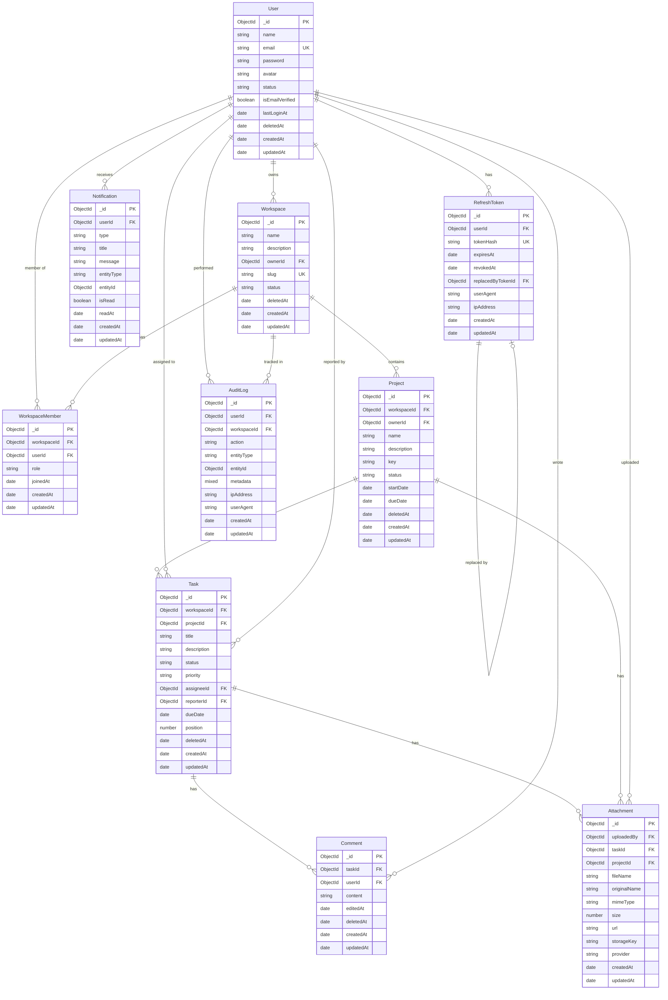

# Mini SaaS Backend

A production-ready Mini SaaS backend inspired by Notion, Trello, and Slack.

## Tech Stack

- **Runtime**: Node.js (≥18)
- **Framework**: Express.js
- **Language**: JavaScript (CommonJS)
- **Database**: MongoDB + Mongoose
- **Validation**: Zod (request) + Mongoose (schema-level)
- **Logging**: Winston
- **Testing**: Jest + mongodb-memory-server

## Architecture

Clean Architecture + Modular Architecture. Each layer has a single responsibility:

```
Request → Middleware → Route → Validator → Controller → Service → Repository → Model → Database
```

## Project Structure

```
server/
├── src/
│   ├── config/
│   │   ├── database.js          # MongoDB connection & graceful shutdown
│   │   └── env.js               # Environment config validated with Zod
│   ├── models/
│   │   ├── User.model.js
│   │   ├── Workspace.model.js
│   │   ├── WorkspaceMember.model.js
│   │   ├── Project.model.js
│   │   ├── Task.model.js
│   │   ├── Comment.model.js
│   │   ├── Notification.model.js
│   │   ├── AuditLog.model.js
│   │   ├── Attachment.model.js
│   │   ├── RefreshToken.model.js
│   │   └── index.js
│   ├── modules/                 # Feature modules (Phase 2+)
│   ├── validators/
│   │   └── common.validator.js  # Shared Zod schemas + validate() middleware
│   ├── middlewares/
│   │   └── error.middleware.js  # Global error & 404 handlers
│   ├── repositories/            # Data access layer (Phase 2+)
│   ├── services/                # Business logic layer (Phase 2+)
│   ├── utils/
│   │   └── logger.js            # Winston logger
│   ├── types/                   # JSDoc type definitions (Phase 2+)
│   ├── app.js                   # Express app setup
│   └── server.js                # Entry point
├── tests/
│   ├── helpers/
│   │   └── db.helper.js         # Test DB utilities
│   ├── models/                  # Model unit tests (10 files)
│   └── setup.js                 # Global Jest setup (MongoMemoryServer)
├── scripts/
│   └── seed.js                  # Database seed script
├── .env.example
├── package.json
├── eslint.config.js
├── prettier.config.js
└── README.md
```

## ER Diagram



## Getting Started

### Prerequisites

- Node.js ≥ 18
- MongoDB ≥ 6

### Installation

```bash
cd server
npm install
```

### Environment Setup

```bash
cp .env.example .env
# Edit .env with your MongoDB URI and other settings
```

### Running

```bash
# Development
npm run dev

# Production
npm start
```

### Seeding

```bash
npm run seed
```

### Testing

```bash
npm test
```

### Linting

```bash
npm run lint
npm run lint:fix
```

## Database Collections

| Collection | Description | Key Indexes |
|---|---|---|
| users | Application users | email (unique), status, deletedAt |
| workspaces | Tenant workspaces | slug (unique), ownerId |
| workspacemembers | Workspace membership | (workspaceId + userId) unique |
| projects | Projects within workspaces | (workspaceId + key) unique |
| tasks | Tasks within projects | projectId+status+position, text(title,description) |
| comments | Task comments | taskId + createdAt |
| notifications | User notifications | userId + isRead + createdAt |
| auditlogs | Immutable audit trail | workspaceId+createdAt, entityType+entityId |
| attachments | File metadata | taskId, projectId, uploadedBy |
| refreshtokens | JWT refresh tokens | tokenHash (unique), userId+expiresAt |

## Phase 2 Remaining Work

- Authentication APIs (register, login, logout, token refresh)
- Workspace & Member management APIs
- Project CRUD APIs
- Task management APIs (with board view support)
- Comment APIs
- Notification APIs (with read/unread)
- File upload APIs (metadata storage)
- Redis caching layer
- BullMQ job queues (email, notifications)
- Socket.IO real-time events
- Repository pattern implementation
- Service layer business logic
- Rate limiting middleware
- Request logging middleware (Morgan/Winston HTTP)
- API documentation (Swagger/OpenAPI)
